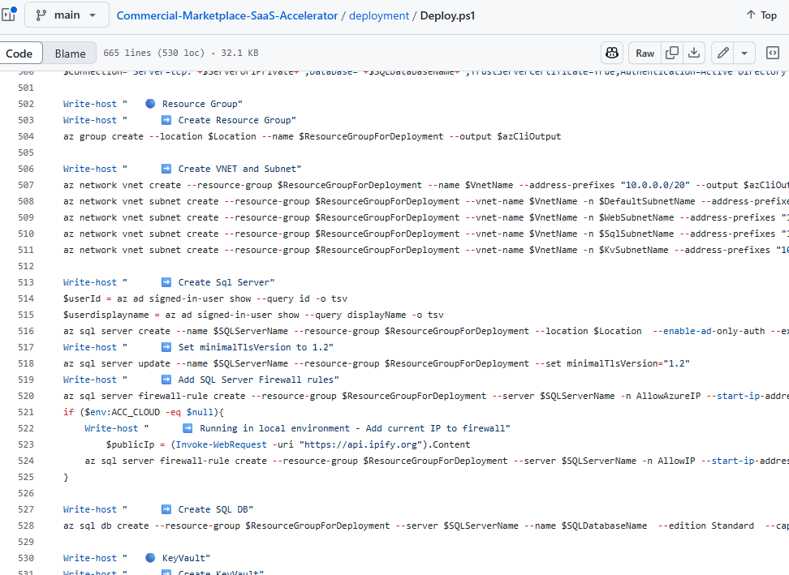
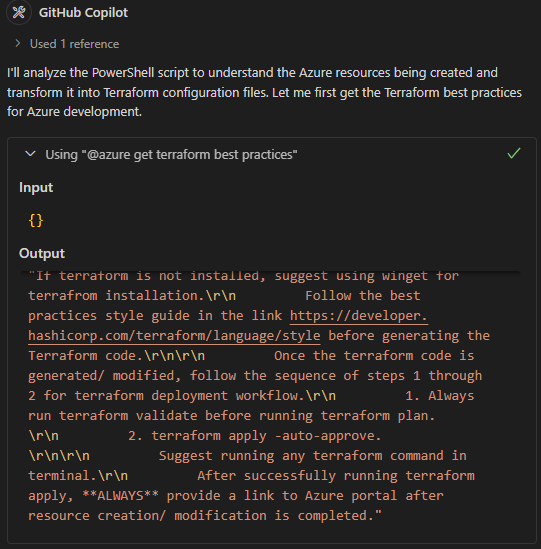
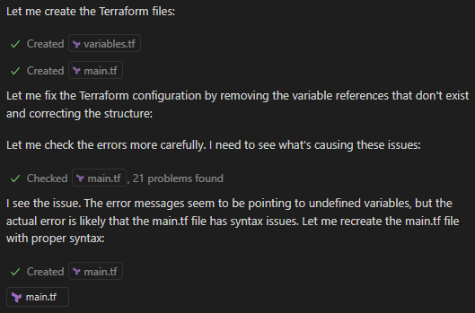
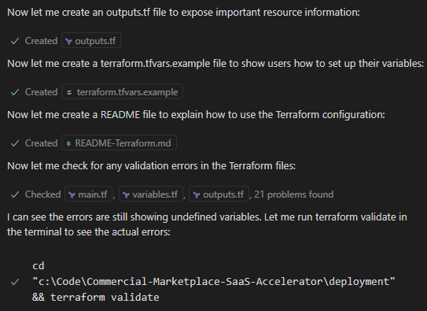
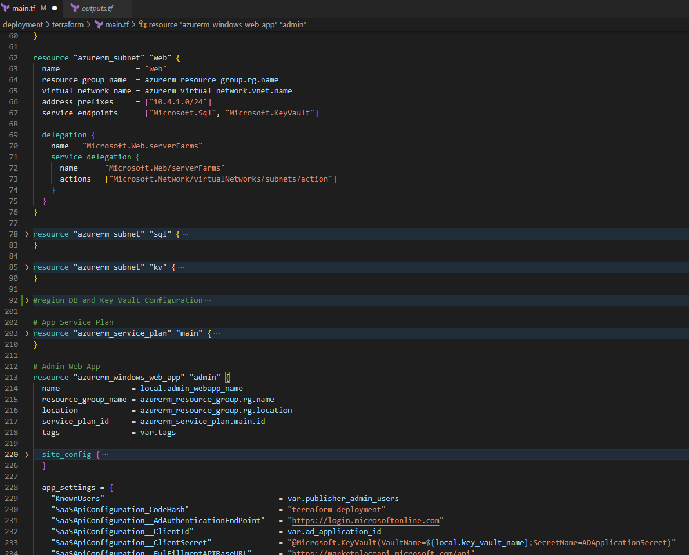
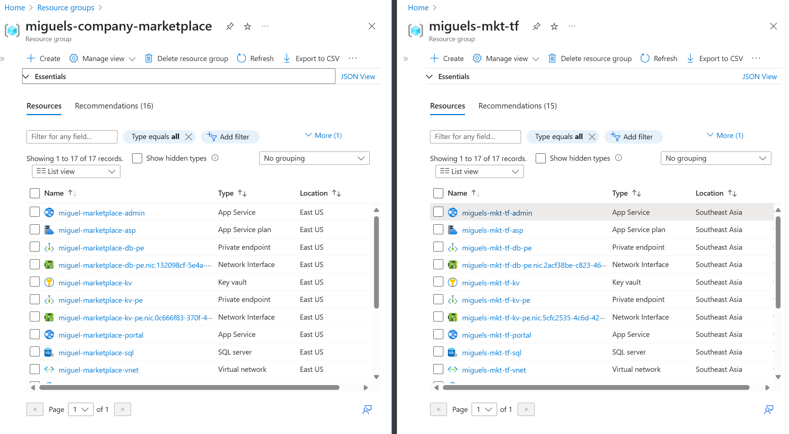

# Adopt an IaC culture with GitHub Copilot
## How my AI Pair Programmer helped me make the shift from imperative to declarative cloud provisioning

### Introduction
Automating cloud environment provisioning is a critical task for fast-moving IT and DevOps teams. While Infrastructure as Code (IaC) tools like Terraform and Azure Bicep have become the gold standard in this field, it is not uncommon for organizations to have libraries of legacy PowerShell and Bash scripts handling deployments, ripe for modernization. 

In this post, I’ll share some of the benefits of adopting IaC in favor of imperative scripts, and show how GitHub Copilot can accelerate the adoption and standardization of IaC.

### Imperative vs Declarative IaC
Let's quickly differentiate the two:

**Imperative tools**, like PowerShell and Bash scripts, describe *how* resources are provisioned. Their sequential nature makes them great for procedural tasks like runbooks. 

**Declarative tools**, like ARM Templates and Terraform files, describe *what* resources should be provisioned. This makes deployments repeatable and consistent, and reduces effort required to handle dependencies.

[Declarative IaC is recommended by the Azure Well-Architected Framework](https://learn.microsoft.com/en-us/azure/well-architected/operational-excellence/infrastructure-as-code-design#prefer-declarative-over-imperative-tools), as it offers several benefits:

- **Simpler syntax:** configuration files are easy to read and maintain, especially across teams with version control.
- **Idempotency:** re-running the same configuration file does not impact existing resources. When modified, only necessary changes are made, preventing duplicate or conflicting resources.
- **Modularity:** Modules can break down complex infrastructure, as well as promote reuse and consistency of standard elements across environments.

### Transforming an imperative script to declarative configuration with GitHub Copilot
#### The Input
For this exercise, I used the [Commercial Marketplace SaaS Accelerator](https://github.com/Azure/Commercial-Marketplace-SaaS-Accelerator), a solution template for Microsoft Partners managing solutions customers purchase over the [Commercial Marketplace](https://azuremarketplace.microsoft.com/en-US/). In the [`deployment`](https://github.com/Azure/Commercial-Marketplace-SaaS-Accelerator/tree/main/deployment) folder, you'll find a PowerShell script called [`Deploy.ps1`](https://github.com/Azure/Commercial-Marketplace-SaaS-Accelerator/blob/main/deployment/Deploy.ps1), which takes input parameters before sequentially validating and deploying the solution resources. Its use of verbose updates, derived variables, and conditionals for validation made it a solid candidate for Terraform transformation.

While I do know how to write Terraform files, I did not want to invest hours scouring over hundreds of lines of PowerShell to ensure I caught every nuanced configuration. Instead, I launched the GitHub Copilot chat window in Visual Studio Code and provided this prompt:

#### The Prompt
` "Understand the Azure resources being configured and created in this Powershell script. Transform this into a new Terraform file called main.tf that resides in the same directory and allows me to declaratively create these resources rather than imperatively. Turn the parameters required into variables and export those into a variables.tf file. You may disregard messages and Write-host commands if they are not important to the terraform version" `

#### GitHub Copilot's Process: Analysis, Generation, and Refinement
Before generating any code, GitHub Copilot "prepared the workspace", understanding the context and obtaining references to help it operate. In this case, it reached out to the [GitHub Copilot for Azure extension](https://learn.microsoft.com/en-us/azure/developer/github-copilot-azure/get-started) and requested best practices for Azure Terraform development

It then parsed the PowerShell script, recognizing and listing the Azure resources it understands will be created. 

This is where code generation began. It began with the `main.tf` and `variables.tf` files that were explicity requested. As those files were generated, it identified syntax errors and unused variables brought in from PowerShell, and repeatedly checked its work as it cleaned its initial output. 

Knowing that a terraform project generally includes an `outputs.tf` and a `terraform.tfvars` file, it then proactively created those items, and even changed the `tfvars` into a `terraform.tfvars.example` to ensure it wouldn't accidentally be used by a new user. To complete its work, it created a `README.md` that documents the code, and ran a final `terraform validate` command to check if everything worked as expected.

Leaving me with a generated output you can see below *(note how subnet delegation, service endpoints, and even programmatically set app settings are preserved)*. Of course, as the output was produced by a "Copilot", I remained in charge of final checks, validations, and test deployment. 

I ultimately applied a few code changes to clean things up, but the end result was **several hours saved** and a deployment consistent with the PowerShell output (`miguels-company-marketplace` was generated by PowerShell, and `miguels-mkt-tf` was generated by Terraform).

The final step I would apply to this next would be exploring the [`null resource`](https://registry.terraform.io/providers/hashicorp/null/latest/docs) to handle SQL provisioning and code deployment, or taking it a step further by moving those instructions into a GitHub Action.

### Conclusion
Through its detailed understanding of imperative deployment scripts and ability to reference best practices of programming languages, GitHub Copilot is a powerful tool that can accelerate the transformation of legacy provisioning scripts into declarative versions, making them more manageable, reusable, auditable. While knowledge of ARM, Terraform, or Bicep is still required to fine-tune the output, GitHub Copilot helps bridge knowledge gaps, massively reduces manual effort, and enables organizations to modernize their cloud operations with confidence.

**You can [get started with GitHub Copilot for Visual Studio Code for free](https://code.visualstudio.com/docs/copilot/overview), and you can view my code outputs in the [GitHub repository](https://github.com/miguelarcilla/Commercial-Marketplace-SaaS-Accelerator/tree/terraform/deployment/terraform).**

Thanks for reading, and Happy Building!

