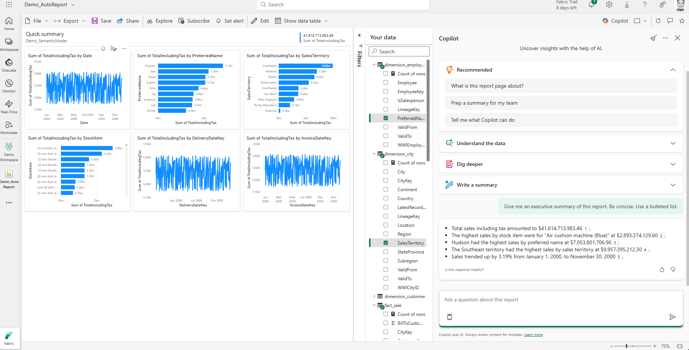
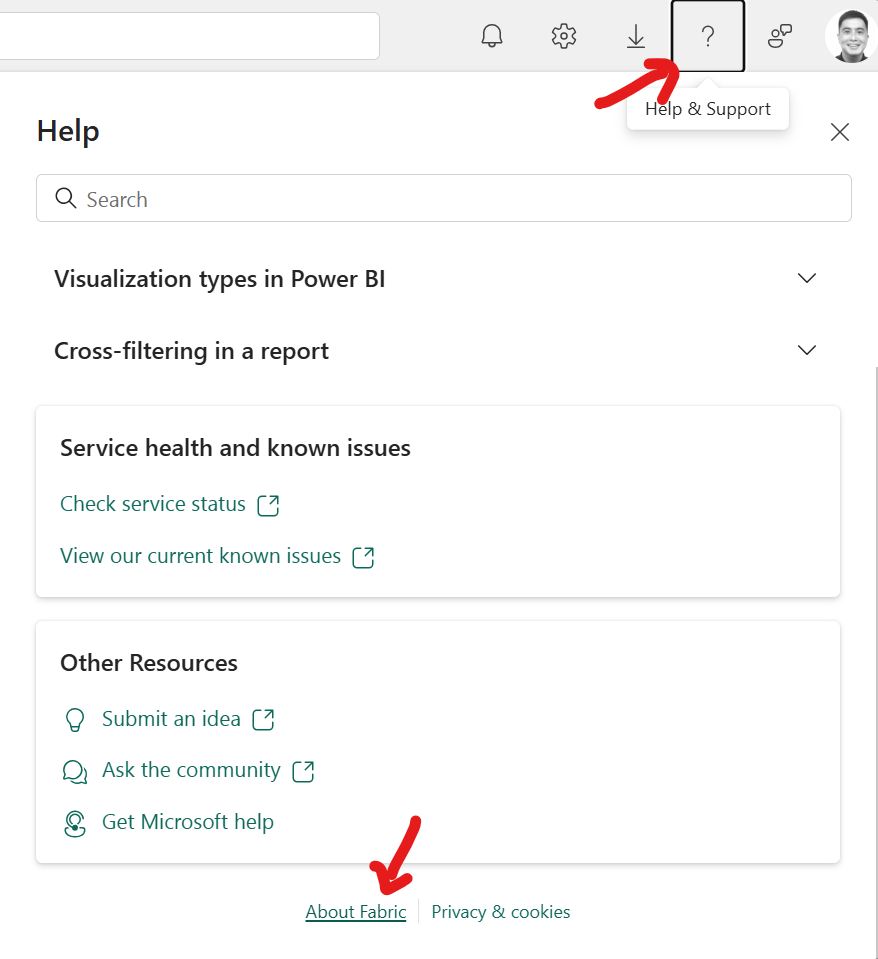
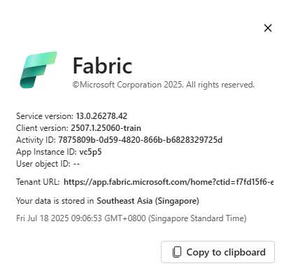
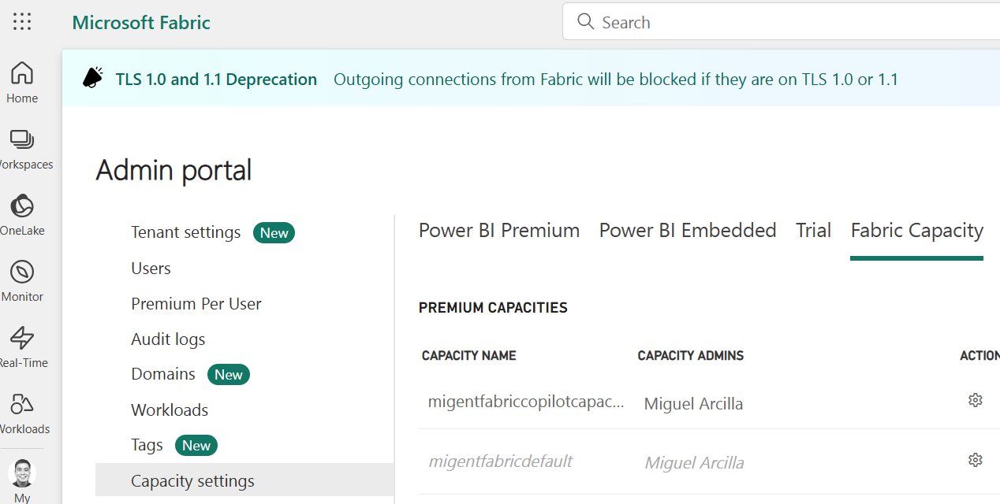
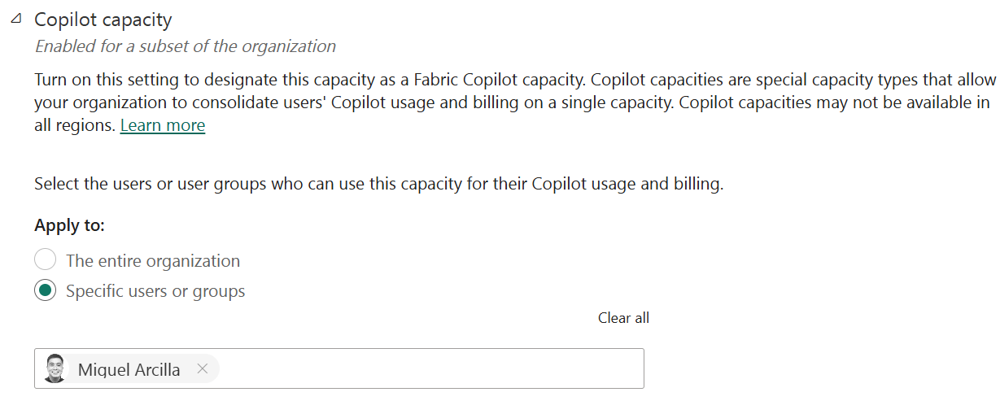
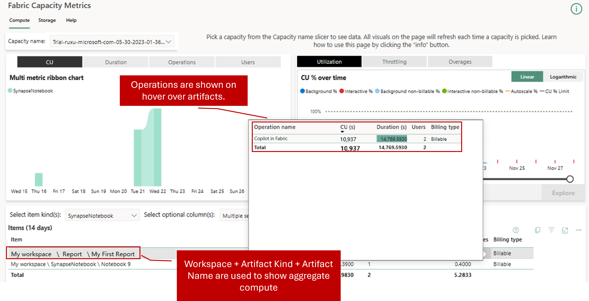

# Enabling Copilot Capacities in Microsoft Fabric: A Quick Guide

*Enrich your organizational data with AI with a lower cost to entry*

---

## Introduction

[Copilot in Microsoft Fabric](https://learn.microsoft.com/en-us/fabric/fundamentals/copilot-fabric-overview) brings AI capabilities to each phase of the analytics lifecycle, from assisting data engineers building data integrations, to data scientists running ML experiments, to business users asking questions about their data. 

With Copilot Capacities, organizations can obtain these AI features in a cost-effective manner, and manage feature access and consumption without impacting production data workloads. This blog post demonstrates how you can quickly budget, enable, monitor, and manage Copilot Capacities. 

## What Are Copilot Capacities?

[Fabric Copilot Capacities](https://learn.microsoft.com/en-us/fabric/enterprise/fabric-copilot-capacity) are Fabric Capacities that centralize the usage and billing of all Copilot in Fabric consumption to a single capacity. This dedicates a pool of Fabric compute resources just to AI tasks, allowing teams to budget their regular Fabric capacities to analytics activities. There are three advantages to doing this:

1. Copilot Capacities can be acquired starting at F2 size SKUs, and **regular capacities no longer need to be F64 and above to be eligible to use Copilot in Fabric.** This represents a significant savings opportunity for organizations who can right-size their deployments, instead of underutilizing large capacities just for the AI features (for example, I can have an F8 Copilot Capacity and an F32 data capacity that meets my needs, and **still save ~37% versus a single F64 capacity**).
2. By right-sizing deployments with Copilot Capacities, teams can ensure that AI activity is managed and scaled separately from data activities like Warehouse queries and data pipeline runs, reducing the risk of impact to regular operations.
3. Copilot Capacities are assigned on a *per-user* basis rather than *per-workspace* that Fabric Capacities use. This means that once a user is granted access to a Copilot Capacity, they can use it across Fabric workspaces without having to worry if their respective workspace is Copilot-enabled.

## Enable Copilot Capacity in Microsoft Fabric

As a Fabric Administrator, follow these steps to enable Copilot Capacity in your Microsoft Fabric environment:

1. **Determine your Fabric home region**: This can be found in the Fabric UI (top right question mark >> About Fabric)

2. **Provision a Fabric Capacity**: From the [Azure Portal](https://portal.azure.com/#view/Microsoft_Azure_Analytics/CreateCapacityBlade), provision a Fabric Capacity of any size, ensuring it is deployed in the same region as your Fabric home region.

3. **Access the Fabric Capacity in Fabric Portal**: Navigate to the Microsoft [Fabric Admin Portal](https://app.fabric.microsoft.com/admin-portal/tenantSettings?experience=fabric-developer) and select Capacity Settings >> Fabric Capacity. Click on your created Fabric Capacity.

4. **Assign the Copilot Capacity**: Scroll to the *"Copilot Capacity"* option and activate the setting. Ensure team members have the necessary permissions to use Copilot features.

## Monitoring Copilot Capacity Usage

You can use the [**Capacity Metrics app**](https://learn.microsoft.com/en-us/fabric/enterprise/metrics-app-install?tabs=1st) to review usage of all your Fabric Capacities, including the Copilot Capacity.

### Tips for Proper Capacity Sizing

- **Start Small**: Begin with a conservative capacity allocation and scale up as usage grows.
- **Monitor Regularly**: Analyze usage reports monthly to adjust capacity as needed.
- **Consider User Patterns**: Factor in the number of active Copilot users and their typical workloads.
- **Consult Microsoft Documentation**: Refer to official guidance for recommended sizing based on organizational needs.

## Conclusion

Copilot Capacities in Microsoft Fabric lower the barrier to entry for AI, making it easier and more cost-effective for organizations to unlock the power of Copilot features. By following best practices for enablement, monitoring, and sizing, you can ensure your teams get the most out of Fabric's AI capabilities. 

**You can [get started with Microsoft Fabric with an F64 capacity free for 60 days](https://aka.ms/tryfabric) and explore how you can bring your analytics to the cloud!**

Thanks for reading, and Happy Building!

