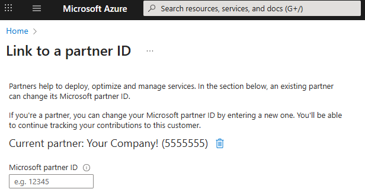

# A Primer on Partner Admin Link (PAL) in Microsoft Azure

*A guide for Microsoft Partners to maximize recognition for their Azure services*

---

## Introduction

The cloud ecosystem continues to evolve, and Microsoft Azure stands at the forefront, empowering partners to deliver value-added solutions to customers worldwide. As Microsoft sharpens its focus on rewarding partners for driving customer success, understanding the mechanisms for tracking and attributing partner influence becomes increasingly important. One such mechanism is the Partner Admin Link (PAL). In this blog post, we’ll explore what PAL is, how it benefits partners seeking incentives and designations, how to establish a PAL relationship, best practices for security, and useful resources to get started.

## What is Partner Admin Link?

The Partner Admin Link (PAL) is a feature in Microsoft Azure that enables partners to associate their Partner ID (formerly known as MPN ID) with Azure subscriptions and resources they manage on behalf of their customers. By establishing this link, Microsoft can accurately attribute partner activities and influence in the customer's Azure environment. Critically, PAL does not grant any additional permissions but simply ties the partner’s Azure Active Directory (AAD) user account to their Partner ID for tracking purposes.

Official Microsoft Documentation: What is Partner Admin Link?

## How Does PAL Benefit Microsoft Partners?
PAL is essential for partners aiming to maximize their recognition and rewards within the Microsoft ecosystem. Here are a few key benefits:
- **Incentives Eligibility:** Microsoft uses PAL to determine which partners are eligible for incentives, such as the Microsoft Commerce Incentive (MCI) program and other rewards for driving Azure consumption.
- **Solutions Partner Designations & Specializations:** PAL-linked activities help partners achieve and maintain Solutions Partner designations and specializations by attributing Azure consumption and success to the correct partner organization.
- **Business Insights:** Partners receive detailed analytics and reporting on their customers’ Azure usage, providing valuable insights to drive further engagement and growth.

Microsoft Solutions Partner Designations | Partner Incentives Overview

## How to Establish a PAL Relationship

Setting up a PAL relationship is a straightforward process:
1. The partner user logs in to the customer’s Azure portal with the appropriate administrative permissions (e.g., Owner, Contributor, or User Access Administrator).
2. Navigate to Partner Admin Link in the Azure portal (usually found under the subscription or resource group settings).
3. Enter the partner organization’s Partner ID.
4. Save the configuration. The user’s account is now linked to the partner organization for that Azure subscription or resource.

Step-by-Step Guide: Link Your Partner ID (PAL) to Customer Azure Subscriptions

## Best Practices for Security and Working with Customers

- Principle of Least Privilege: Only assign the minimum required permissions to partner accounts. Avoid granting excessive rights.
- Use Dedicated Accounts: Create dedicated partner admin accounts for PAL linkage, separate from everyday user accounts, for better auditing and control.
- Transparency with Customers: Clearly explain the purpose and benefits of PAL to customers, and document their approval for compliance.
- Monitor and Review: Regularly review linked accounts and permissions to ensure ongoing security and correct attribution.
- Remove PAL When Needed: If a partner’s relationship with a customer ends, promptly remove the PAL linkage to avoid misattribution.

## Security Considerations for PAL

## Conclusion

Partner Admin Link is a powerful yet simple tool that allows Microsoft partners to receive recognition, incentives, and valuable insights for their work managing customer Azure environments. By setting up PAL correctly and following best practices, partners can ensure accurate attribution, maintain security, and foster trust with customers. For more information, refer to the official Microsoft documentation and stay engaged with the Partner Center for updates.
Microsoft Partner Center | Learn More About PAL

Thanks for reading, and Happy Building!

