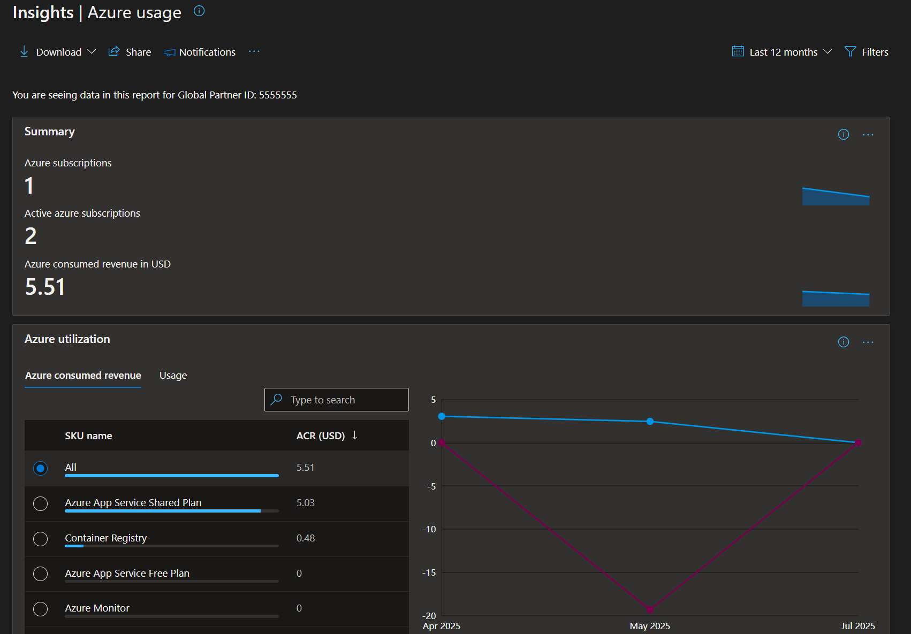
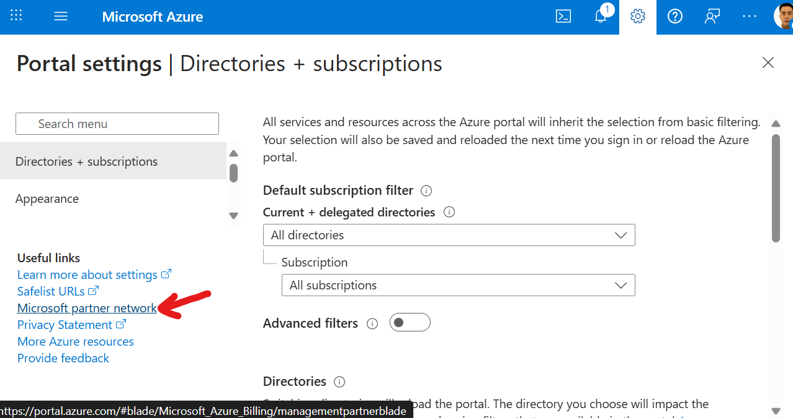

# A Primer on Partner Admin Link (PAL) in Microsoft Azure

*A guide for Microsoft Partners to maximize recognition for their Azure services*

---

## Introduction

Microsoft boasts the largest partner ecosystem in the tech industry, with [over 500,000 organizations worldwide](https://blogs.microsoft.com/blog/2025/03/24/microsoft-at-50-the-journey-and-future-of-the-partner-ecosystem/) helping Microsoft customers thrive. In such a competitive marketplace, partners need to harness every available tool to stand out and succeed. 

[Partner Admin Link (PAL)](https://learn.microsoft.com/en-us/azure/cost-management-billing/manage/link-partner-id) is one such tool that helps partners receive credit for their impact and achieve eligibility for incentives, credentials, and benefits. In this post, we will explore how PAL recognizes partners, how to establish a PAL relationship, tips for managing PAL, and the benefits of maximizing PAL tagging.

## What is Partner Admin Link?

PAL is a feature in Microsoft Azure that lets partners associate identities (individual user accounts or shared services logins) in customer environments with their Partner ID, in turn recognizing them for managing Azure services on behalf of their customers. This helps partners who specialize in deployments and managed services receive credit for influencing the customer's usage without necessarily being the same partner who bills them for their Azure subscription This is also useful when customers contract multiple service providers to handle different Azure workloads; **each partner gets recognized for the services over which they have an administrative influence**.

Critically, PAL does not grant any additional permissions on top of what is granted to the identity; it simply ties the Entra ID account to the Partner ID for tracking purposes.

## How Does PAL Benefit Microsoft Partners?

PAL is essential for partners aiming to maximize their recognition and rewards within the Microsoft ecosystem. Some of the key benefits include:

- **Boost Partner Credentials:** [68% of customers searching for software solutions prefer Microsoft Partners with certified credentials.](https://learn.microsoft.com/en-us/partner-center/referrals/solutions-partner-certified-software-designations-benefits#overview-of-benefits) Badges like [Solution Partner Designations](https://learn.microsoft.com/en-us/partner-center/membership/introduction-to-pcs), [Specializations](https://learn.microsoft.com/en-us/partner-center/membership/specializations), and [Certified Software Designations](https://learn.microsoft.com/en-us/partner-center/referrals/solutions-partner-certified-software-designations-introduction) are critical to helping partners stand out and meet these requirements. However, earning these badges requires varying levels of proven Azure usage, either 1st-pary (spent by the partner) or 3rd-party (influenced by the partner). By maximizing PAL linkage in managed projects, partners can accelerate their eligibility to earn these important badges.

- **Incentive Eligibility:** Another benefit of becoming a credentialed partner is access to commercial incentives, like the [Azure Accelerate program](https://partner.microsoft.com/en-us/partnership/azure-offerings). This enables partners to receive additional funding directly from Microsoft for delivering proofs of value and production rollouts with customers. By having good PAL practices, you can maximize your recognition and incentive eligibility.

- **Business Insights:** The [Insights page in Microsoft Partner Center](https://partner.microsoft.com/en-us/dashboard/insights/partnerinsights/azureusage) provides detailed analytics and reporting on Partners influenced Azure usage, and can reveal valuable insights on workloads around which new services can be offered.

## How to Establish a PAL Relationship

Setting up a PAL relationship is a straightforward process, and can be done interactively via Azure Portal, or automated via [Powershell](https://learn.microsoft.com/en-us/azure/cost-management-billing/manage/link-partner-id#use-powershell-to-link-to-a-new-partner-id) or [az cli](https://learn.microsoft.com/en-us/azure/cost-management-billing/manage/link-partner-id#use-the-azure-cli-to-link-to-a-new-partner-id). We will list the interactive steps below:

1. Log in to the customer’s Azure environment with your user account. This can be a vendor email address, service account, or your usual work email that's been invited to the customer's tenant via [Microsoft Entra B2B](https://learn.microsoft.com/en-us/entra/external-id/user-properties).

2. Navigate to the ["Link to a partner ID page"](https://portal.azure.com/#view/Microsoft_Azure_Billing/ManagementPartnerBlade) or click on the **Settings icon** at the top right, followed by the **Microsoft Partner Network** at the bottom left.

3. Enter the partner organization’s Partner ID.

4. Save the configuration. The account has now been associated to your partner organization.

## PAL Best Practices

- **Principle of Least Privilege:** Only assign the minimum required permissions to partner accounts. Avoid granting excessive rights.
- **Use Dedicated Accounts:** Create dedicated partner admin accounts for PAL linkage, separate from everyday user accounts, for better auditing and control.
- **Transparency with Customers:** Clearly explain the purpose and benefits of PAL to customers, and document their approval for compliance.
- **Monitor and Review:** Regularly review linked accounts and permissions to ensure ongoing security and correct attribution.
- **Remove PAL When Needed:** If a partner’s relationship with a customer ends, promptly remove the PAL linkage to avoid misattribution.

## Conclusion

Partner Admin Link is a powerful yet simple tool that allows Microsoft partners to receive recognition, incentives, and valuable insights for their work managing customer Azure environments. By setting up PAL correctly and following best practices, partners can ensure accurate attribution, maintain security, and foster trust with customers. For more information, refer to the official Microsoft documentation and stay engaged with the Partner Center for updates.
Microsoft Partner Center | Learn More About PAL

Thanks for reading, and Happy Building!

