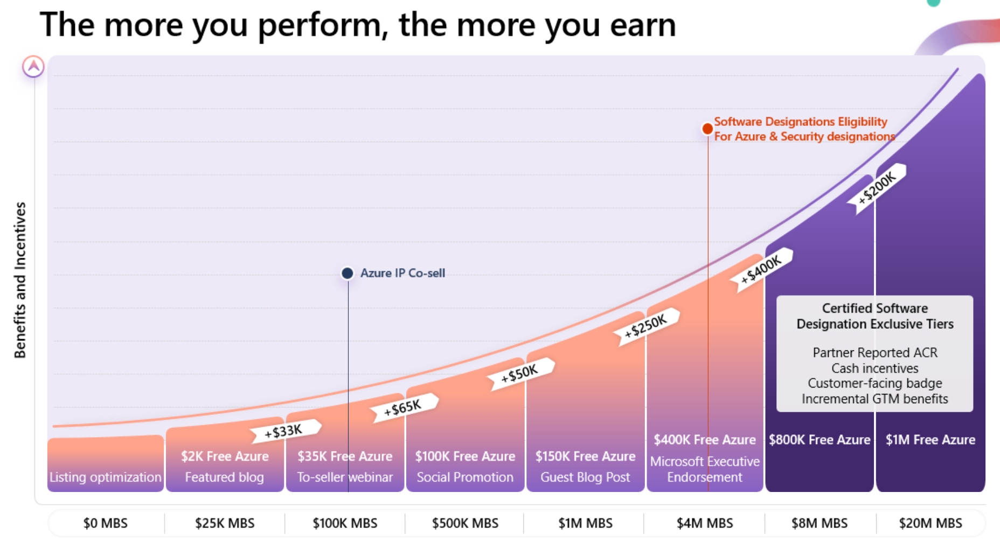
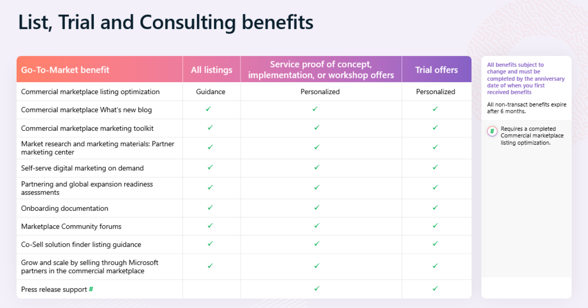
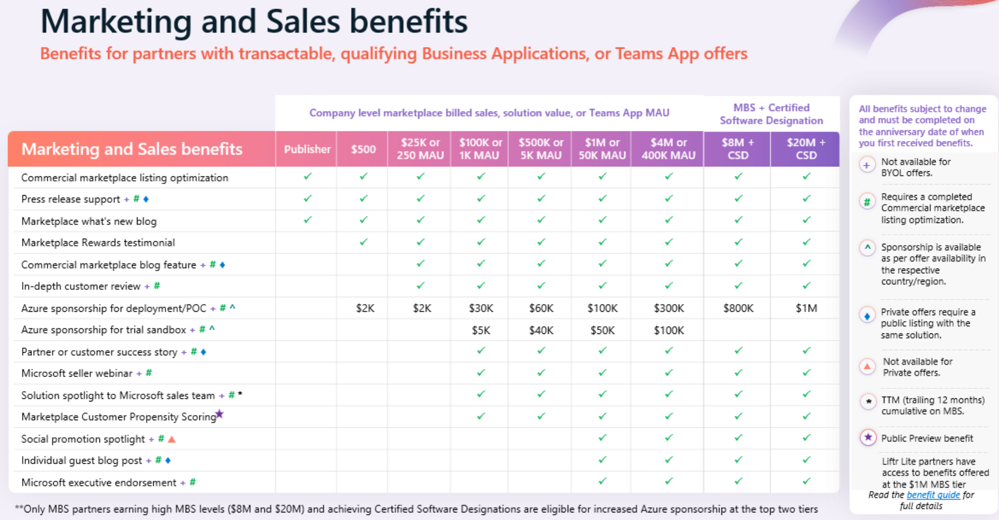
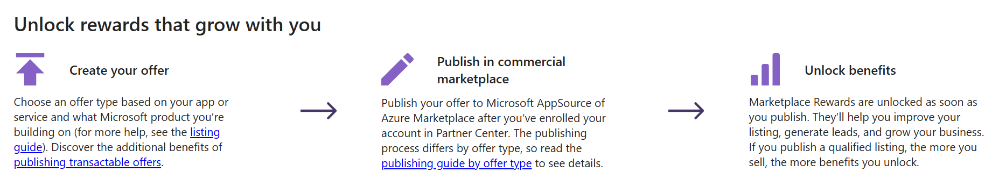
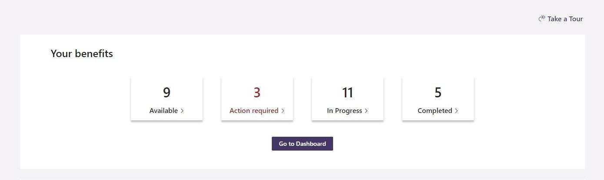
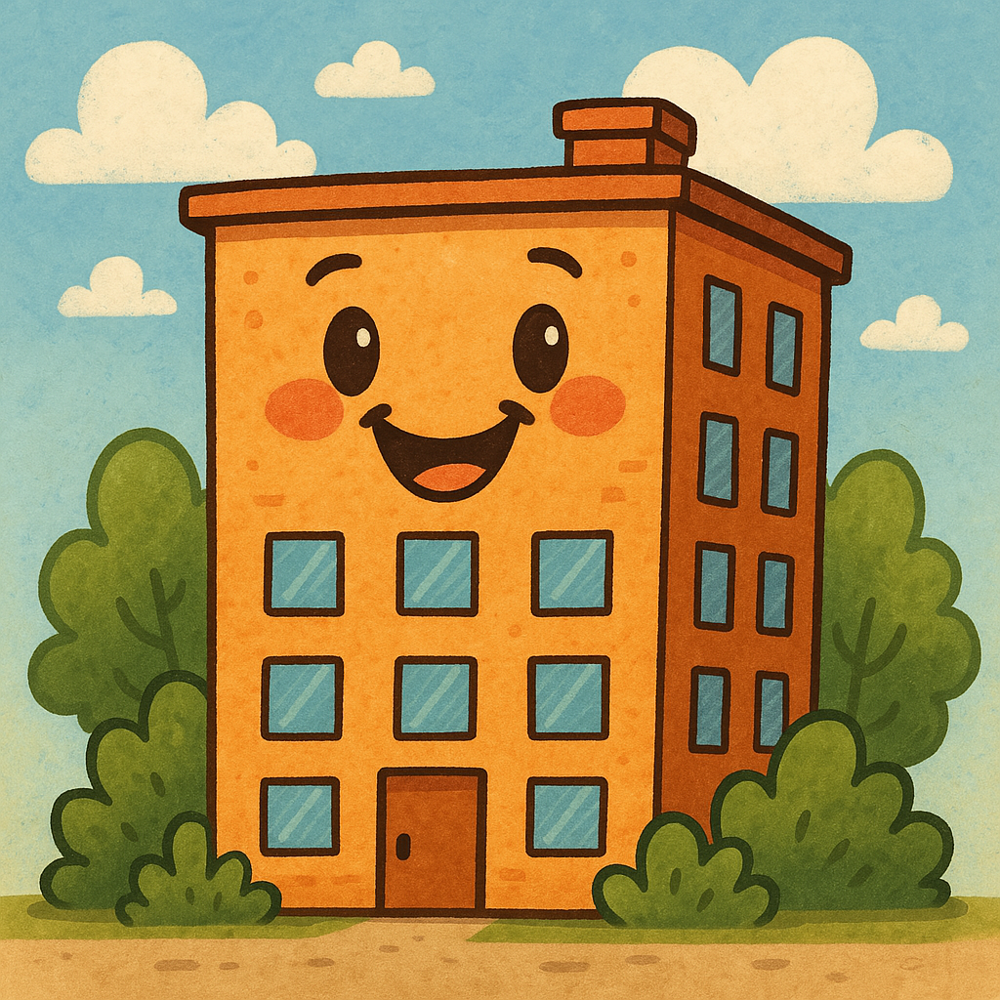

# A Primer on Microsoft Marketplace Rewards

*A guide for Microsoft Partners to activate, access, and grow benefits from maximizing Microsoft's Commercial Marketplace*

---

## Introduction

Microsoft offers industry-leading platforms for partners to build and sell value-added IP, and with rapidly growing commercial marketplaces in [Azure Marketplace](https://azuremarketplace.microsoft.com/en-US/) and [AppSource](https://appsource.microsoft.com/en-us/), it's easier than ever for users to discover, purchase, and activate solutions that build on Azure, Microsoft 365, Dynamics 365, and even Copilot!

[Marketplace Rewards](https://www.microsoft.com/en-us/isv/Marketplace-Rewards) is an incentive program that provides Microsoft partners selling through the marketplace with a suite of perks that accelerate growth, close more deals, and encourage consistent innovation and co-selling.

In this post, we'll discuss the benefits, what's new, and how to get started with Marketplace Rewards.

---

## Marketplace Rewards: What's in it for me?

**Once a Microsoft Partner has published a solution on the Marketplace, they become eligible for Marketplace Rewards, and as these published solutions mature and grow in revenue, new benefits are unlocked.**

*Contactable listings* (solutions advertised, but not purchased, through the marketplace) gain 6 months of marketing-related benefits, including mentions in the Commercial marketplace blog, access to a self-serve marketing toolkit, and listing optimization guidance. While it is a good start, and helps achieve baseline [Co-Sell Ready requirements](https://learn.microsoft.com/en-us/partner-center/referrals/co-sell-requirements#requirements-for-co-sell-ready-status) (a must when working with Microsoft field sales teams), it is just the tip of the iceberg.

*Transactable listings* are where the real fun begins.

With transactable offers, partners gain access to seriously scalable perks, including Azure sponsorships for POCs and trial sandboxes, solution spotlights highlighting your offer internally to Microsoft field sales, and elevated publicity with featured blog posts and executive endorsements.

---

## What’s New in Marketplace Rewards

For the current fiscal year (FY26), Microsoft has introduced several updates to the Marketplace Rewards program to make it even more impactful for partners:

- **Streamlined Tiers:** The rewards structure has been simplified, making it easier for partners to understand and unlock new benefits as they progress.

- **Expanded Go-To-Market Benefits:** New marketing and sales enablement resources have been added, including enhanced analytics and deeper integration with Microsoft’s field sales teams.

- **Faster Onboarding:** Improved onboarding processes help partners access rewards more quickly and efficiently.

- **Increased Focus on Co-Sell:** There is a greater emphasis on co-selling opportunities, allowing partners to collaborate more closely with Microsoft sellers to reach new customers.

- **Enhanced Technical Support:** Additional technical workshops and solution assessments are now available to help partners optimize their offerings for Azure and other Microsoft platforms.

---

## How to enroll in Marketplace Rewards

Here's the quickest way to get started with Microsoft Marketplace Rewards:

1. **Become a Partner:** If you’re not yet a Microsoft Partner, join the Microsoft AI Cloud Partner Program by enrolling in [Partner Center](https://partner.microsoft.com/en-us/dashboard/account/v3/enrollment/introduction/partnership) or by signing up for the [ISV Success Program](https://www.microsoft.com/en-us/isv/enroll/signup). 

2. **Publish Your Solution:** List your app or service on Microsoft AppSource or Azure Marketplace. For a great starting point to listing your first Marketplace offering, check out the [Mastering the Marketplace Series](https://microsoft.github.io/Mastering-the-Marketplace/).

3. **Set up a Marketing Contact:** Ensure you have added at least one [Marketing Contact in Partner Center](https://partner.microsoft.com/dashboard/v2/benefits/marketing); these contacts will receive communications about your Marketplace Rewards.

4. **Activate Your Benefits:** Once eligible, navigate to the [Marketplace Rewards Toolbox](https://marketing.partner.microsoft.com/marketplace-rewards) to access and activate your Marketplace Rewards benefits.

Check out [this link](https://learn.microsoft.com/en-us/partner-center/marketplace-offers/marketplace-rewards#your-steps-to-get-started-are-easy) for more detailed instructions.

---

## Conclusion

With Marketplace Rewards, partners can unlock a host of benefits and opportunities to help your business thrive in partnership with Microsoft. Get started with Marketplace Rewards by publishing to the Marketplace today and take your solution to the next level!

For a detailed view into Marketplace Rewards, [check out this slide deck](https://aka.ms/marketplacerewards); many of the screenshots in this post are care of this presentation.

For more info on Marketplace Rewards and the ISV Success program, [start here](https://learn.microsoft.com/en-us/partner-center/marketplace-offers/marketplace-rewards).

Stay up-to-date with your Marketplace Rewards enrollment status in [Partner Center](https://partner.microsoft.com/dashboard/v2/benefits/marketing).

Thanks for reading, and Happy Building!

